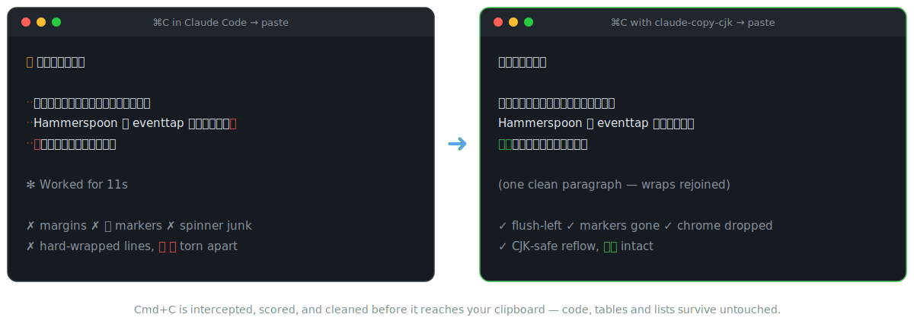
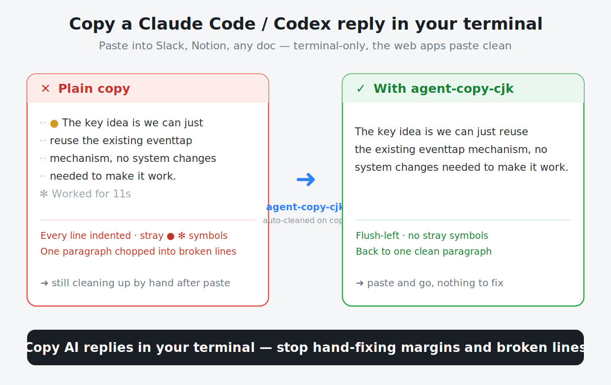
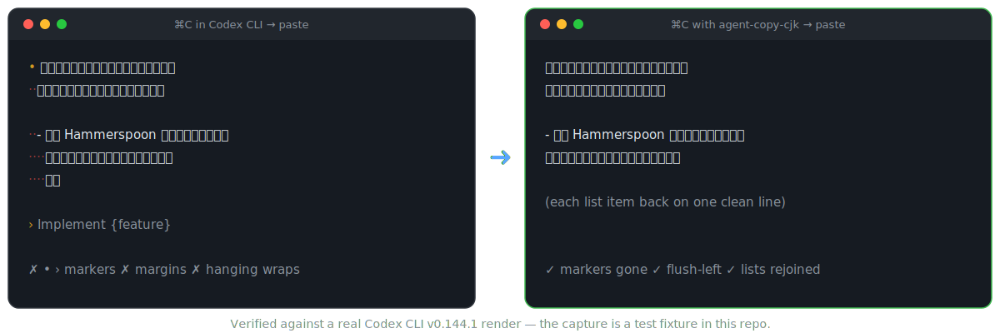
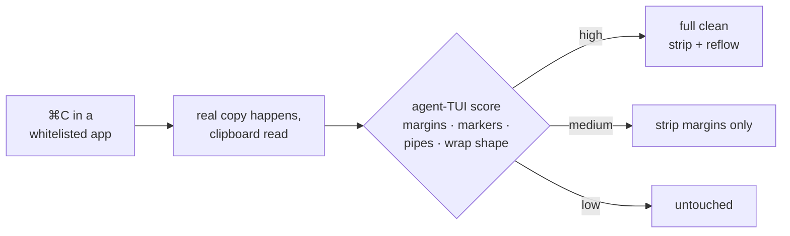

<div align="center">

# agent-copy-cjk

**English** · [简体中文](README.zh-CN.md)

**Copy from the [Claude Code](https://claude.com/claude-code) or [Codex CLI](https://github.com/openai/codex) terminal UI. Paste clean text. Every time.**

The clipboard cleaner that understands CJK — 中文 / 日本語 / 한국어 wraps rejoin perfectly, `修改` never becomes `修 改`.




</div>

---

Select text in an agent TUI, hit `⌘C`, and your clipboard fills with rendering junk: 2-space margins on every line, `⏺` `❯` `⎿` (Claude Code) or `•` `›` (Codex) markers, `✻ Worked for 11s` spinner lines, and hard line breaks at the terminal width that shred your paragraphs.

**agent-copy-cjk** is a tiny [Hammerspoon](https://www.hammerspoon.org/) interceptor that catches `⌘C` in your terminal, scores how agent-TUI-like the copied text is, and cleans it *before you paste* — conservatively, so code, tables, and everything non-agent pass through untouched.

<div align="center">

</div>

The junk above is plain English — margins, stray markers, a paragraph shredded across lines. CJK gets a whole extra failure mode on top (see [below](#why-cjk-needs-its-own-fork)); a CJK before/after:

```diff
- ⏺ 修复方案如下：
-
-   这个方案的关键在于我们可以直接复用 Hammerspoon 提供的 eventtap 机制来拦截快捷键，不需要修
-   改任何系统设置就能生效。
-
- ✻ Worked for 11s
+ 修复方案如下：
+
+ 这个方案的关键在于我们可以直接复用 Hammerspoon 提供的 eventtap 机制来拦截快捷键，不需要修改任何系统设置就能生效。
```

### Codex CLI gets the same treatment

Codex renders its own junk — `•` response bullets, `›` prompt echoes, hanging-indent list wraps. Same interceptor, same clean paste:



## Install in 30 seconds

```bash
git clone https://github.com/kindtree/agent-copy-cjk.git
cd agent-copy-cjk && ./install.sh
```

The script installs [Hammerspoon](https://www.hammerspoon.org/) if missing, drops two Lua files into `~/.hammerspoon/`, and wires them into your config. Grant Accessibility permission once, reload, done — there is no UI, it just works on every `⌘C`.

### Or let your AI agent install it

Already inside Claude Code / Codex? Paste this prompt and it handles everything:

```text
Set up agent-copy-cjk on this Mac:

1. Clone https://github.com/kindtree/agent-copy-cjk.git to ~/Code/agent-copy-cjk.
2. Run ./install.sh from the repo root. It installs Hammerspoon via Homebrew if
   missing, copies init.lua to ~/.hammerspoon/claude-copy.lua and clean.lua to
   ~/.hammerspoon/clean.lua, and appends one dofile line to ~/.hammerspoon/init.lua.
   Do not modify anything else in my Hammerspoon config.
3. If a standalone `lua` is available, run `lua test.lua` and
   `lua test_deficiencies.lua` inside the repo and confirm every test passes.
4. Launch (or restart) Hammerspoon. If macOS hasn't granted it Accessibility
   permission yet, walk me through System Settings → Privacy & Security →
   Accessibility, then wait for my confirmation.
5. Have me verify: select a multi-line reply in Claude Code or Codex CLI, press
   Cmd+C, paste anywhere — it should paste flush-left with paragraphs rejoined
   and no ⏺/•/✻ markers.
```

## What gets fixed

| Junk in your clipboard | What you paste instead |
|---|---|
| `··` 2-space margin on every line | Flush-left text (nested indent preserved) |
| `⏺` `❯` `⎿` markers (Claude Code) · `•` `›` markers (Codex CLI) | Just the content |
| `✻ Worked for 11s` · `(ctrl+o to expand)` · `────` | Dropped entirely |
| Paragraphs hard-wrapped at terminal width | Rejoined into real paragraphs |
| Wrapped list items (`- …` / `1. …`), even a stranded `3. API` head | Each item back on one line |
| Word torn at the wrap point: `修` ⏎ `改` | `修改` — joined with no stray space |
| Trailing whitespace | Gone |

And just as important, what **never** gets touched: code blocks (indentation intact), `ls`/`ps`/table output (column alignment detected and protected), shell prompts, and anything that doesn't look like agent TUI output — the scorer is deliberately conservative, low confidence means hands off.

## Why CJK needs its own fork

Every heuristic in a clipboard reflower — "does this line reach the wrap width?", "is this a short intentional break?" — measures line width. Upstream measures **bytes**. A CJK character is 3 bytes but 2 terminal columns, so for Chinese, Japanese, or Korean text every one of those checks is wrong, and mixed 中英文 paragraphs fail in both directions.

This fork rebuilds the pipeline on **UTF-8 display width**:

- 🀄 **Wrap detection in columns, not bytes** — pure-CJK, pure-ASCII, and mixed paragraphs all rejoin correctly.
- ✂️ **CJK-aware joining** — CJK has no space-based word boundaries, so joins at a CJK edge never inject a space: `修` + `改` → `修改`, never `修 改`.
- 。**CJK punctuation** — `。！？：；…` count as sentence ends, so three short complete sentences stay three lines instead of merging into one.
- 🏷️ **Fullwidth key-value** — `标题：…` lines keep their structure, exactly like `Title: …`.
- 📐 **Greedy-wrap rescue** — agent TUIs wrap at spaces, so a long unbroken CJK run gets pushed to the next line, leaving a stub like `3. API`. The reflower reasons about *why* the line broke and rejoins it.

All of it verified against **real TUI renders** — Claude Code v2.1.207 and Codex CLI v0.144.1, captured with `tmux capture-pane`. The fixtures are in this repo, not hand-typed approximations.

## How it works



Detection is multi-signal scoring, not a single regex: margin coverage, `│`/`⎿` pipes, `⏺`/`❯`/`•`/`›` markers, diff patterns, numbered lines, markdown structure, and wrapped-line geometry all vote. Prompt-looking lines vote against. Three safety guards sit on top: never overwrite a clipboard that changed mid-clean (race), never write an empty result, never stall on a >512 KB copy.

**Agent TUIs:** Claude Code · Codex CLI
**Terminal hosts:** [Ghostty](https://ghostty.org/) · [iTerm2](https://iterm2.com/) · Terminal.app · [Alacritty](https://alacritty.org/) · [kitty](https://sw.kovidgoyal.net/kitty/) · [WezTerm](https://wezterm.org/) · [Hyper](https://hyper.is/) · [Warp](https://www.warp.dev/) · Rio · Tabby · Wave · [cmux](https://github.com/manaflow-ai/cmux) · Claude desktop app

## Configuration

Thresholds live at the top of [`clean.lua`](clean.lua); the app whitelist at the top of [`init.lua`](init.lua). This fork ships slightly more aggressive defaults than upstream (it will clean even a single-line copy):

| Key | This fork | Upstream | Meaning |
|-----|:---:|:---:|---|
| `minNonEmptyLines` | 1 | 2 | Minimum non-empty lines before cleaning is considered |
| `minMarginCoverage` | 0.50 | 0.65 | Fraction of lines that must carry the 2-space margin |
| `stripOnlyThreshold` | 2 | 4 | Score needed for margin-strip-only cleaning |

Prefer upstream's more conservative behavior? Set the upstream values and reload.

## Tests

```bash
lua test.lua               # upstream suite (21) — no regressions
lua test_deficiencies.lua  # CJK · TUI-artifact · reflow · Codex suite (27), built on real captures
```

The `tui-fixture-*.txt` files are genuine Claude Code and Codex CLI screen captures; every fix in this fork started life as a failing test against one of them.

## Limitations

- macOS only (Hammerspoon requirement).
- Only keyboard `⌘C` is intercepted — copy-on-select and context-menu copy are not.
- Fenced code blocks are flattened by the terminal's own clipboard handling before any script can run.
- At ASCII↔CJK join boundaries the original spacing is unrecoverable; this fork drops the space (`Python脚本`) because keeping words whole beats keeping decorative spaces.

## Credits

Hard fork of [andersmyrmel/claude-copy](https://github.com/andersmyrmel/claude-copy) (MIT) — the interception design and conservative-scoring idea are his. Upstream was in turn inspired by [Clean-Clode](https://github.com/TheJoWo/Clean-Clode).

## License

[MIT](LICENSE) — original copyright Anders; CJK, Codex, and Claude-Code-host additions copyright kindtree.

---

<div align="center">

**If this just fixed your paste, it'll fix your teammate's too — a ⭐ helps them find it.**

</div>
