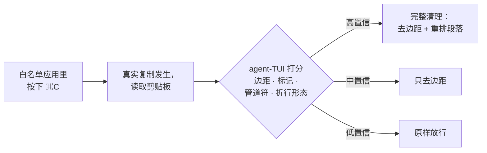

<div align="center">

# agent-copy-cjk

[English](README.md) · **简体中文**

**从 [Claude Code](https://claude.com/claude-code) / [Codex CLI](https://github.com/openai/codex) 终端界面复制，粘贴出来永远是干净文本。**

真正懂 CJK 的剪贴板清理器——中文折行完美拼回，「修改」永远不会变成「修 改」。


</div>

---

在 agent 终端界面里选中文字按 `⌘C`，剪贴板里全是渲染垃圾：每行开头 2 格边距、`⏺` `❯` `⎿`（Claude Code）或 `•` `›`（Codex）标记、`✻ Worked for 11s` 状态行，还有按终端宽度硬折断的段落——粘到哪里都是碎的。

**agent-copy-cjk** 是一个极小的 [Hammerspoon](https://www.hammerspoon.org/) 拦截器：捕获终端里的 `⌘C`，先给复制内容打分判断是不是 agent TUI 输出，再**在你粘贴之前**分级清理。策略刻意保守——代码、表格、以及一切不像 agent 输出的内容原样放行。

```diff
- ⏺ 修复方案如下：
-
-   这个方案的关键在于我们可以直接复用 Hammerspoon 提供的 eventtap 机制来拦截快捷键，不需要修
-   改任何系统设置就能生效。
-
- ✻ Worked for 11s
+ 修复方案如下：
+
+ 这个方案的关键在于我们可以直接复用 Hammerspoon 提供的 eventtap 机制来拦截快捷键，不需要修改任何系统设置就能生效。
```

### Codex CLI 同样适用

Codex 有自己的一套垃圾——`•` 回复标记、`›` 输入回显、悬挂缩进的列表折行。同一个拦截器，同样干净的粘贴：


## 30 秒安装

```bash
git clone https://github.com/kindtree/agent-copy-cjk.git
cd agent-copy-cjk && ./install.sh
```

脚本会自动装 [Hammerspoon](https://www.hammerspoon.org/)（如果没有）、把两个 Lua 文件放进 `~/.hammerspoon/` 并接入配置。授一次辅助功能权限、重载配置就完事——没有界面，之后每次 `⌘C` 自动生效。

### 或者：直接让 AI 帮你装好

已经在用 Claude Code / Codex？把下面这段 prompt 原样发给它，全程自动搞定：

```text
在这台 Mac 上帮我装好 agent-copy-cjk：

1. 把 https://github.com/kindtree/agent-copy-cjk.git 克隆到 ~/Code/agent-copy-cjk。
2. 在仓库根目录运行 ./install.sh。它会在缺少 Hammerspoon 时用 Homebrew 安装、
   把 init.lua 复制为 ~/.hammerspoon/claude-copy.lua、clean.lua 复制为
   ~/.hammerspoon/clean.lua，并向 ~/.hammerspoon/init.lua 追加一行 dofile。
   除此之外不要动我 Hammerspoon 配置里的任何东西。
3. 如果本机有独立的 lua 命令，在仓库里运行 lua test.lua 和
   lua test_deficiencies.lua，确认所有测试通过。
4. 启动（或重启）Hammerspoon。如果 macOS 还没给它辅助功能权限，引导我去
   系统设置 → 隐私与安全性 → 辅助功能 里打开，然后等我确认。
5. 最后让我验证：在 Claude Code 或 Codex CLI 里选中一段多行回复按 Cmd+C，
   随便粘贴到哪里——应该顶格、段落完整拼回、没有 ⏺/•/✻ 标记。
```

## 修什么

| 剪贴板里的垃圾 | 粘贴出来的样子 |
|---|---|
| 每行开头的 `··` 2 格边距 | 顶格文本（嵌套缩进保留） |
| `⏺` `❯` `⎿`（Claude Code）· `•` `›`（Codex）标记 | 只留内容 |
| `✻ Worked for 11s` · `(ctrl+o to expand)` · `────` | 整行丢弃 |
| 按终端宽度硬折断的段落 | 拼回完整段落 |
| 折行的列表项（`- …` / `1. …`），包括 `3. API` 这种被落下的短头 | 每项拼回一行 |
| 在折行点被拆散的词：`修` ⏎ `改` | `修改`——拼接处绝不多出空格 |
| 行尾空白 | 清除 |

同样重要的是**绝不碰什么**：代码块（缩进原样）、`ls`/`ps`/表格输出（自动识别列对齐并保护）、shell 提示符，以及一切不像 agent TUI 输出的内容——打分器刻意保守，置信度不够就不动手。

## 为什么 CJK 需要专门一个 fork

剪贴板重排器里的每一条启发式——「这行有没有顶到折行宽度？」「这是不是刻意的短行？」——都在量行宽。上游量的是**字节**。一个 CJK 字符占 3 字节却只占 2 个终端列，所以对中日韩文本，所有这些判断全是错的，中英混排段落两头都会失败。

这个 fork 把整条管线重建在 **UTF-8 显示宽度**上：

- 🀄 **按列而非字节检测折行**——纯中文、纯英文、中英混排段落全部正确拼回。
- ✂️ **CJK 感知拼接**——CJK 没有空格词边界，拼接点任一侧是 CJK 就绝不插空格：`修` + `改` → `修改`，绝不是 `修 改`。
- 。**中文标点**——`。！？：；…` 计入句末判断，三个完整短句保持三行，不会被误合并。
- 🏷️ **全角冒号键值对**——`标题：…` 和 `Title: …` 一样保持独立结构。
- 📐 **贪婪折行救援**——agent TUI 按空格折行，一长串无空格中文会被整体推到下一行，留下 `3. API` 这样的短头。重排器会推理这行*为什么*断，并正确拼回。

以上全部用**真实 TUI 渲染**验证——Claude Code v2.1.207 与 Codex CLI v0.144.1，`tmux capture-pane` 采集。测试夹具就在仓库里，不是手打的近似样本。

## 工作原理



检测是多信号打分而不是一条正则：边距覆盖率、`│`/`⎿` 管道符、`⏺`/`❯`/`•`/`›` 标记、diff 特征、行号、markdown 结构、折行几何形态一起投票，长得像 shell 提示符的行投反对票。之上还有三道保险：清理期间剪贴板被别人写入就不覆盖（防竞态）、绝不写入空结果、超过 512 KB 的复制直接放行不卡顿。

**支持的 agent TUI：** Claude Code · Codex CLI
**支持的终端宿主：** [Ghostty](https://ghostty.org/) · [iTerm2](https://iterm2.com/) · Terminal.app · [Alacritty](https://alacritty.org/) · [kitty](https://sw.kovidgoyal.net/kitty/) · [WezTerm](https://wezterm.org/) · [Hyper](https://hyper.is/) · [Warp](https://www.warp.dev/) · Rio · Tabby · Wave · [cmux](https://github.com/manaflow-ai/cmux) · Claude 桌面版

## 配置

阈值在 [`clean.lua`](clean.lua) 顶部，应用白名单在 [`init.lua`](init.lua) 顶部。本 fork 的默认值比上游更激进（单行复制也会清理）：

| 配置项 | 本 fork | 上游 | 含义 |
|-----|:---:|:---:|---|
| `minNonEmptyLines` | 1 | 2 | 触发清理所需的最少非空行数 |
| `minMarginCoverage` | 0.50 | 0.65 | 带 2 格边距的行占比下限 |
| `stripOnlyThreshold` | 2 | 4 | 「只去边距」模式所需分数 |

想要上游那种更保守的行为？改成上游值重载即可。

## 测试

```bash
lua test.lua               # 上游套件（21 个）——零回归
lua test_deficiencies.lua  # CJK · TUI 杂物 · 重排 · Codex 套件（27 个），基于真实采集
```

`tui-fixture-*.txt` 是 Claude Code 和 Codex CLI 的真实屏幕采集；这个 fork 里的每一个修复，最初都是针对其中某个夹具的一条失败测试。

## 限制

- 仅 macOS（Hammerspoon 依赖）。
- 只拦截键盘 `⌘C`——「选中即复制」和右键菜单复制拦不到。
- 围栏代码块（三反引号）在脚本运行前就被终端自身的剪贴板处理压平了。
- 中英边界处原始空格无法复原；本 fork 选择不加空格（`Python脚本`）——保住词的完整性比保住装饰性空格更重要。

## 致谢

硬 fork 自 [andersmyrmel/claude-copy](https://github.com/andersmyrmel/claude-copy)（MIT）——按键拦截设计与保守打分思路来自原作者。上游又受 [Clean-Clode](https://github.com/TheJoWo/Clean-Clode) 启发。

## 许可证

[MIT](LICENSE)——原始版权归 Anders；CJK、Codex 与 Claude Code 宿主相关增强版权归 kindtree。

---

<div align="center">

**如果它刚刚治好了你的粘贴，它也能治好你同事的——点个 ⭐ 让更多人找到它。**

</div>
